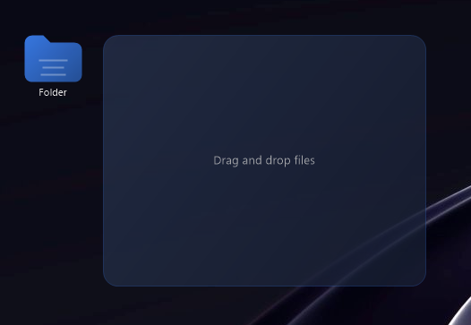

# 📁 Folder Widget

**Windows masaüstü için özelleştirilebilir klasör widget'ları - C++ Win32 API**


<p align="center">
  
</p>

## ✨ Özellikler

- 📁 **Birden fazla klasör** - İstediğiniz kadar widget oluşturun
- 🎨 **Renk özelleştirmesi** - Her klasör için farklı renk seçin
- 🖱️ **Sürükle-bırak** - Dosyaları kolayca ekleyin
- 💾 **Otomatik kaydetme** - Pozisyon ve içerik otomatik saklanır
- 🔄 **Animasyonlu açılma** - Tıklayınca sağa doğru genişler
- 🖥️ **System tray** - Arka planda çalışır
- ⚙️ **Sağ tık menüsü** - Kolay ayarlar

## 🛠️ Gereksinimler

| Gereksinim | Versiyon |
|------------|----------|
| İşletim Sistemi | Windows 10/11 |
| Derleyici | Visual Studio 2019/2022 veya MinGW |
| CMake | 3.20+ |

## 🚀 Kurulum

### Otomatik Derleme
```batch
# Repo'yu klonlayın
git clone https://github.com/KULLANICI_ADI/folder-widget.git
cd folder-widget

# Derleyin
build.bat
```

### Manuel Derleme
```batch
mkdir build
cd build
cmake .. -G "Visual Studio 17 2022" -A x64
cmake --build . --config Release
```

## 📖 Kullanım

1. `build\Release\FolderWidget.exe` dosyasını çalıştırın
2. Masaüstünüzde bir klasör ikonu görünecek

| Eylem | Sonuç |
|-------|-------|
| **Sol tık** | Klasörü aç/kapat |
| **Sağ tık** | Menü (renk, isim, sil) |
| **Dosya sürükle** | Klasöre ekle |
| **System tray** | Yeni klasör oluştur |

## 📂 Proje Yapısı

```
folder-widget/
├── src/
│   ├── main.cpp           # Giriş noktası
│   ├── FolderWidget.h     # Başlık dosyası
│   ├── FolderWidget.cpp   # Ana implementasyon
│   └── Config.h           # JSON config parser
├── config/
│   └── folders.json       # Klasör verileri (örnek)
├── CMakeLists.txt         # CMake yapılandırması
├── build.bat              # Derleme scripti
└── README.md
```

## 🔧 Teknik Detaylar

- **Pure Win32 API** - Harici framework bağımlılığı yok
- **GDI+** - Grafik renderlemesi
- **JSON** - Konfigürasyon dosya formatı
- **Modern C++17** - Standart

## 📝 Lisans

Bu proje [MIT Lisansı](LICENSE) altında lisanslanmıştır.

---

<p align="center">
  Made with ❤️ using C++ and Win32 API
</p>
